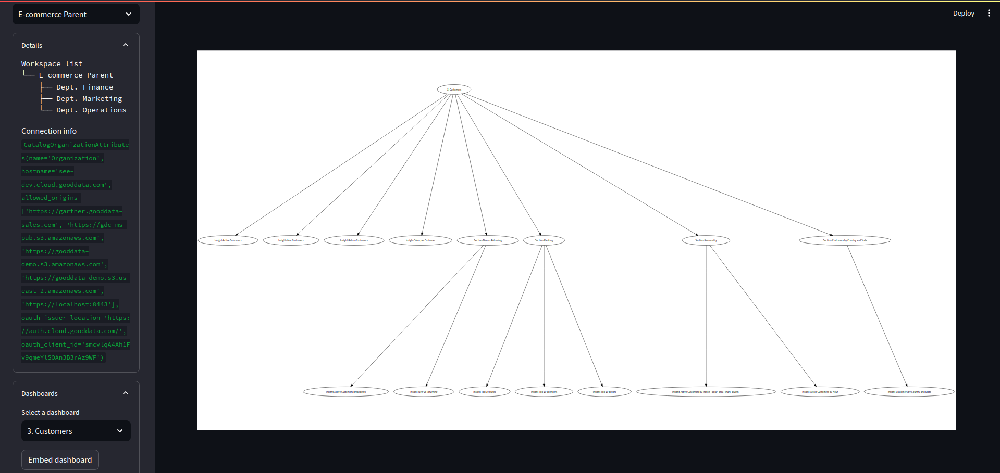

# GoodData Cloud streamlit

A demo application to showcase a custom UI for interacting with [GoodData Cloud / CN instances](https://www.gooddata.com/docs/). It is using [Python SDK](https://www.gooddata.com/docs/python-sdk/latest/) library in the background.

## How to deploy a working prototype

The first step is to fork the repository or download it and publish to your own Github. 

1. Create virtual environment in python `python -m venv streamlit`
2. start the environment `source streamlit/bin/activate` and install requirements with `pip install -r ./requirements.txt` 
3. Fill custom variables into `.streamlit/secrets.toml` file: 
   - [endpoint URL](https://www.gooddata.com/developers/cloud-native/doc/cloud/getting-started/get-gooddata/) as `GOODDATA_HOST`
   - [personal access token](https://www.gooddata.com/developers/cloud-native/doc/cloud/getting-started/create-api-token/) as `GOODDATA_TOKEN`
   - [OpenAI API key](https://platform.openai.com/docs/quickstart?context=python) as `OPENAI_API_KEY` and `OPENAI_ORGANIZATION` 
4. Run the streamlit app
   - vscode config (usually bound to <kbd>F5</kbd> key)
   - `python -m streamlit run app.py`
5. Deploy the app (for free)
   - the Github repository has to be set as public
   - avoid `secrets.toml` file to be uploaded to a repository
   - instead use [this aproach](https://docs.streamlit.io/streamlit-community-cloud/get-started/deploy-an-app/connect-to-data-sources/secrets-management)

## TO-DO

- [ ] Add dependabot to the repository
- [ ] Prepare various concepts as git branches
- [ ] Deploy the app
- [ ] 
