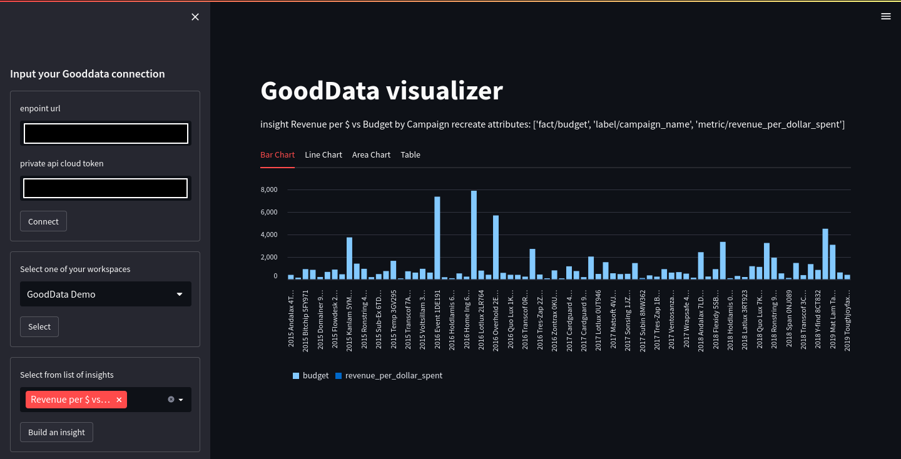

# GoodData Cloud streamlit

A demo streamlit applications for various showcases:

- Basic interaction with [GoodData Cloud / CN instances](https://www.gooddata.com/developers/cloud-native/doc/cloud/deploy-and-install/)

- GoodData / Arria NG communication
-

## Workspace preparation

1. Install requirements with `pip install -r /path/to/requirements.txt`
2. Check `vscode/launch.json` setting available to launch streamlit
