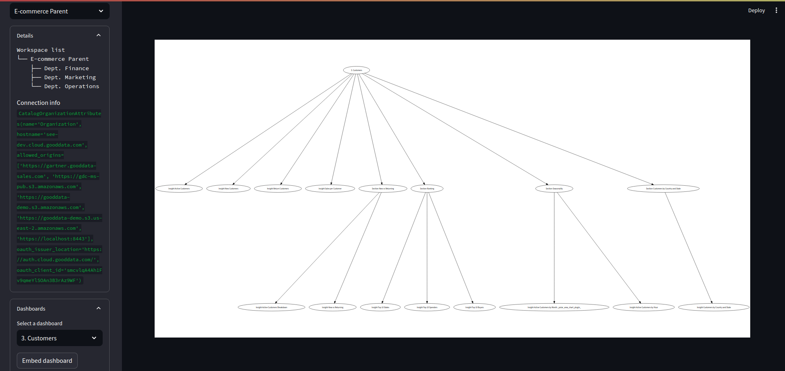

# GoodData Cloud streamlit

A demo application to showcase a custom UI for interacting with [GoodData Cloud / CN instances](https://www.gooddata.com/docs/). It is using [GoodData Python SDK](https://www.gooddata.com/docs/python-sdk/latest/) library in the background.



Main functionality include:

- Workspace layout display
- Dashboard embedding and declarative display
- Display users and groups
- Parse CSVs to SQL datasets

## How to deploy a working prototype

The first step is to fork the repository or download it and publish to your own Github. Please note that if you want to deploy that it works only for public repositories.

1. Create virtual environment in python `python -m venv venv`
2. Start the environment with `source venv/bin/activate` and install requirements with `pip install -r ./requirements.txt`
3. (optional) upgrade requirements to latest `pip-compile --upgrade --strip-extras requirements.in`
4. Configure the GoodData connection. The TOML file is local-only and is ignored by git:
   - [endpoint URL](https://www.gooddata.com/developers/cloud-native/doc/cloud/getting-started/get-gooddata/) as `GOODDATA_HOST`
   - [personal access token](https://www.gooddata.com/developers/cloud-native/doc/cloud/getting-started/create-api-token/) as `GOODDATA_TOKEN`
   - optional `GOODDATA_DEFAULT_WORKSPACE` and `GOODDATA_DEFAULT_DATASOURCE` values to preselect a workspace
5. Run the streamlit app
   - vscode config (usually bound to <kbd>F5</kbd> key)
   - `python -m streamlit run app.py`
6. Deploy the app (for free)
   - once you run in developement mode, hit the "Deploy" button
   - do not commit any `.toml` file containing secrets
   - after selecting the public repository and `app.py`, open **Advanced settings → Secrets** and paste:

     ```toml
     GOODDATA_HOST = "https://your-gooddata-host/"
     GOODDATA_TOKEN = "your-personal-access-token"
     GOODDATA_DEFAULT_WORKSPACE = "optional-workspace-id"
     GOODDATA_DEFAULT_DATASOURCE = "optional-datasource-id"
     ```

   - see [Streamlit secrets management](https://docs.streamlit.io/deploy/streamlit-community-cloud/deploy-your-app/secrets-management) for the hosting UI

For local development, create `.streamlit/secrets.toml` with the same keys. The
`.streamlit/*.toml` rule in `.gitignore` keeps local secrets and Streamlit
configuration out of the public repository.

## TO-DO

- [ ] Better dashboard handling
- [ ] Demo content deployment
- [ ] PDF generator (for insights and dashboards)
